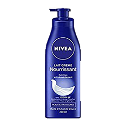
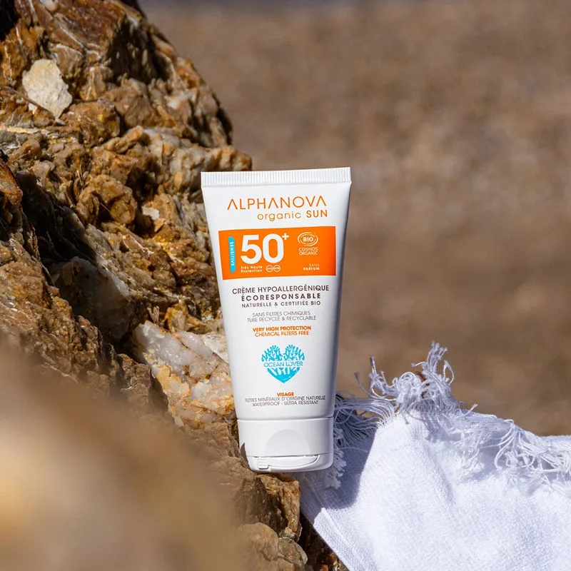

<!DOCTYPE html>
<html lang="ar">
<head>
<meta charset="UTF-8">
<meta name="viewport" content="width=device-width, initial-scale=1.0">
<title>الموقع الرسمي للمنتجات</title>

<link href="https://fonts.googleapis.com/css2?family=Playfair+Display:wght@500;600&family=Inter:wght@300;400&display=swap" rel="stylesheet">

</head>
<body>

  
Brand Officiel

  
منتجات راقية، تجربة مثالية.

  

    
    <!-- البطاقة الرئيسية -->
    <a href="https://wa.me/212691444558?text=سلام، بغيت نطلب الجل" target="_blank" class="product-main">
      
      
جيل تثبيت الشعر

      

        جل قوي لتثبيت الشعر، يعطي لمعة طبيعية ويترك شعرك ثابت طوال اليوم بدون قساوة.
      

      <ul class="features">
        <li>✔ ثبات قوي</li>
        <li>✔ ملمس طبيعي</li>
        <li>✔ مناسب للاستخدام اليومي</li>
      </ul>
      
35 درهم

      
اطلب الآن عبر واتساب

    </a>

    <!-- الصف ديال البطاقات الصغرى -->
    

      <!-- المنتج الثاني -->
      <a href="https://wa.me/212691444558?text=سلام، بغيت نطلب سبراي" target="_blank" class="product-card">
        
        
سبراي تثبيت الشعر

        
سبراي خفيف يعطي ثبات متوسط ولمسة ناعمة مع حماية من الرطوبة.

        <ul class="features">
          <li>✔ ثبات متوسط</li>
          <li>✔ حماية من الرطوبة</li>
          <li>✔ مثالي للشعر القصير والطويل</li>
        </ul>
        
40 درهم

        
اطلب الآن عبر واتساب

      </a>

      <!-- المنتج الثالث -->
      <a href="https://wa.me/212691444558?text=سلام، بغيت نطلب واكس" target="_blank" class="product-card">
        
        
واكس الشعر

        
واكس غني لتشكيل الشعر بسهولة ولمسة نهائية لامعة طبيعية.

        <ul class="features">
          <li>✔ تشكيل سهل ومرن</li>
          <li>✔ لمسة لامعة طبيعية</li>
          <li>✔ مثالي للشعر القصير والطويل</li>
        </ul>
        
45 درهم

        
اطلب الآن عبر واتساب

      </a>
    

  

</body>
</html>
